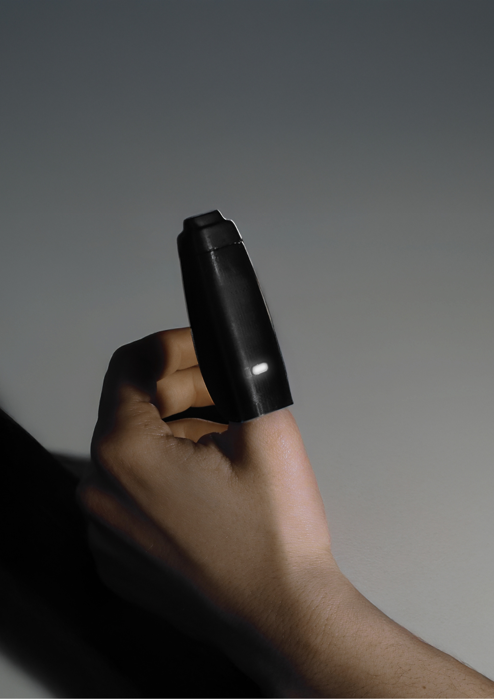

# Portfolio — Aya Jalid

Site portfolio personnel. Design & Architecture 2025.

## Structure des fichiers

```
aya-portfolio/
├── index.html                    ← Page d'accueil (tous les projets + bio + contact)
├── style.css                     ← Tout le CSS partagé
├── cv-aya-jalid.pdf              ← À AJOUTER : ton CV en PDF
│
├── projet-puul.html
├── projet-design-week.html
├── projet-crouslab.html
├── projet-stage-crouslab.html
├── projet-tercel.html
├── projet-design-maker.html
├── projet-vivre-espace.html
├── projet-jerada.html
├── projet-reinventer-paris.html
├── projet-siege.html
│
└── images/                       ← Toutes tes photos ici
    ├── aya.jpg                   ← Ta photo (section À propos)
    ├── puul.jpg                  ← Image carte projet PUUL
    ├── puul-cover.jpg
    ├── puul-prototypes.jpg
    ├── puul-packaging.jpg
    ├── puul-app.jpg
    ├── puul-schema.jpg
    ├── design-week.jpg           ← Image carte Design Week
    ├── design-week-expo.jpg
    ├── design-week-stand.jpg
    ├── design-week-public.jpg
    ├── crouslab.jpg              ← Image carte CrousLab
    ├── crouslab-plan.jpg
    ├── crouslab-zone1.jpg
    ├── crouslab-zone2.jpg
    ├── crouslab-detail.jpg
    ├── stage-crouslab.jpg        ← Image carte Stage
    ├── stage-crouslab-chantier.jpg
    ├── stage-plan.jpg
    ├── stage-realisation.jpg
    ├── tercel.jpg                ← Image carte TerCel
    ├── tercel-cover.jpg
    ├── tercel-echantillons.jpg
    ├── tercel-schema.jpg
    ├── tercel-modules.jpg
    ├── tercel-assemblage.jpg
    ├── design-maker.jpg          ← Image carte Design Maker
    ├── design-maker-cover.jpg
    ├── design-maker-process.jpg
    ├── design-maker-final.jpg
    ├── vivre-espace.jpg          ← Image carte Vivre l'espace
    ├── vivre-espace-render.jpg
    ├── vivre-espace-site.jpg
    ├── vivre-espace-site2.jpg
    ├── vivre-espace-programme.jpg
    ├── vivre-espace-plan.jpg
    ├── vivre-espace-coupe.jpg
    ├── jerada.jpg                ← Image carte Jerada
    ├── jerada-cover.jpg
    ├── jerada-batiment.jpg
    ├── jerada-axonometrie.jpg
    ├── jerada-vue1.jpg
    ├── jerada-vue2.jpg
    ├── reinventer-paris.jpg      ← Image carte Réinventer Paris
    ├── reinventer-paris-facade.jpg
    ├── reinventer-plans.jpg
    ├── reinventer-coupes.jpg
    ├── reinventer-vue1.jpg
    ├── reinventer-vue2.jpg
    ├── siege.jpg                 ← Image carte Siège
    ├── siege-cover.jpg
    ├── siege-plan-rdc.jpg
    ├── siege-plan-r1.jpg
    └── siege-vue.jpg
```

## Comment ajouter une image

1. Place l'image dans le dossier `images/`
2. Nomme-la exactement comme indiqué dans la liste ci-dessus
3. Dans le fichier HTML correspondant, trouve le bloc :
   ```html
   <div class="img-placeholder">📁 images/nom-image.jpg — description</div>
   ```
4. Remplace-le par :
   ```html
   
   ```
5. Pour les images de la grille (cartes), trouve dans index.html :
   ```html
   <span class="card-placeholder">📁 images/puul.jpg</span>
   ```
6. Remplace-le par :
   ```html
   
   ```

## Mettre à jour le contenu

- **Texte** → ouvre le fichier .html correspondant, trouve le texte, modifie-le, sauvegarde
- **Liens réseaux sociaux** → dans `index.html`, cherche `href="#"` dans la section contact
- **Email / téléphone** → cherche `aya.jalid0@gmail.com` et `+33 6 79 95 00 22`
- **CV** → remplace `cv-aya-jalid.pdf` par ton fichier PDF

## Déployer les changements (GitHub Pages)

```bash
git add .
git commit -m "mise à jour : description du changement"
git push
```
Le site se met à jour automatiquement en ~30 secondes.
